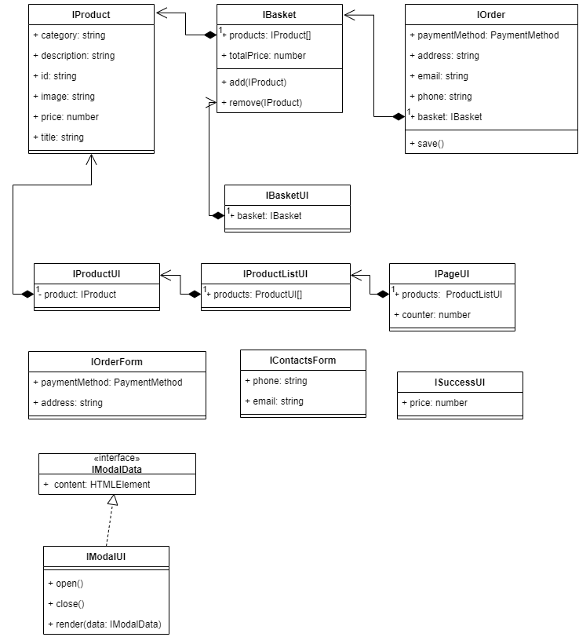

# Проектная работа "Веб-ларек"

Стек: HTML, SCSS, TS, Webpack

Структура проекта:
- src/ — исходные файлы проекта
- src/components/ — папка с JS компонентами
- src/components/base/ — папка с базовым кодом

Важные файлы:
- src/pages/index.html — HTML-файл главной страницы
- src/types/index.ts — файл с типами
- src/index.ts — точка входа приложения
- src/styles/styles.scss — корневой файл стилей
- src/utils/constants.ts — файл с константами
- src/utils/utils.ts — файл с утилитами

## Установка и запуск
Для установки и запуска проекта необходимо выполнить команды

```
npm install
npm run start
```

или

```
yarn
yarn start
```
## Сборка

```
npm run build
```

или

```
yarn build
```

## Архитектура


## Базовый код
### Класс `Api`
Базовый класс для получения товаров с сервера.

### Класс `EventEmitter`
Брокер событий, классическая реализация.

## Компоненты модели данных (бизнес-логика)
### Интерфейс `IProduct`
Предоставляет информацию о товаре: заголовок, описание, картинка, категория, цена, айди.

### Интерфейс `IBasket`
Описание корзины: список товаров, возможность добавить или удалить товары из корзины.

### Интерфейс `IOrder`
Описание заказа пользователя: Вид оплаты, адрес, имя, почта и список товаров которые заказал пользователь.
Также предоставляет возможность сохранить заказ.

## Компоненты представления
### Интерфейс `IProductUI`
Отвечает за отображение товара в списке товаров или в превью товара.
### Интерфейс `IProductListUI`
Отвечает за отображение списка товаров на странице.
### Интерфейс `IPageUI`
Отвечает за отображение страницы: список товаров и счетчик товаров в корзине.
### Интерфейс `IBasketUI`
Отвечает за отображение и изменение товаров в корзине.
### Интерфейс `IOrderForm`
Отвечает за отображение формы ввода метода оплаты и адреса.
### Интерфейс `IContactsForm`
Отвечает за отображение формы ввода имени и email пользователя.
### Интерфейс `ISuccessUI`
Отвечает за отображение сообщения об успешном заказе.
### Интерфейс `IModalUI`
Отвечает за отображение контента в модальных окнах.

## Ключевые типы данных
### PaymentMethod
Вид оплаты
```
export enum PaymentMethod {
    CASH,
    CARD,
}
```
### IModalData
Описание данных для отображения в модальном окне `IModalUI`.